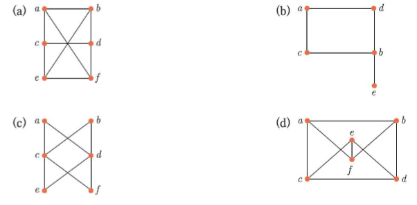
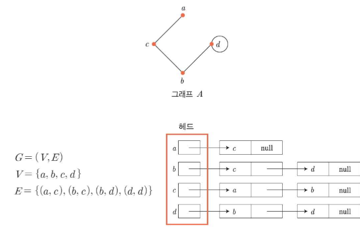

# 1.집합
## 수의 체계
### 자연수 N
0 보다 큰 양의 정수
### 정수 Z
양의 정수, 음의 정수, 0
### 유리수 Q
a,b 가 정수이고 a!=0일 때 b/a
### 무리수 I
a,b 가 정수이고 a!=0일 때 b/a로 표현되지 않는 수 
### 실수 R
유리수 + 무리수
### 복소수 C
실수 + 허수(i)

## 연산
### 닫혀있다.
S에 속하는 a,b를 연산자 O로 연산한 결과가 S에 속하면 닫혀있다.
- 자연수는 덧셈에는 닫혀있지만 뺄셈에는 닫혀있다. 
- 예외로는 유리수의 나눗셈에서 0을 나누는 경우는 없으므로 닫혀있다.
### 항등원
a,b는 허수가 아니고 a,b가 O에 대해 닫혀있을 때 aOb = bOa = a를 만족하는 b
- 합에 대한 항등원:0
- 곱에 대한 항등원:1
### 역원
a,b,c는 허수가 아니고 a,b가 O에 대해 닫혀있으면서, c가 연산자 O에 대해 항등원일 때 aOb = bOa = c를 만족하는 b
- a 합에 대한 역원:-a  , c=0
- a의 곱에 대한 역원:1/a ( a !=0)  , c=1
### 합, 곱 연산
합 : 시그마, 곱 : 프로덕트, 계승 : 펙토리얼
### 나누어 떨어진다
정수 n을 자연수 d로 나누었을 때 몫을 q, 나머지를 r이라고 하면
#### n = dq+r
- r = 0 일 때, n은 d로 나누어 떨어진다. d|n
- r != 0 일 때, n은 d로 나누어 떨어지지 않는다. d!|n (차마 기호를 못 그리겠네)
#### 규칙
- d|m 이고 d|n이면, d|(m+n), d|(m-n)
- d|m 이면 d|mn
- a|b 이고 b|C 이면, a|c
### 몫 div
q = n div d
r = n mod d
## 진법
### 진법 변환
- 10-> 2,8,16  그냥 나누면 된다.
- 2->8 3개씩 묶는다.
- 2->16 4개씩 묶는다.
- 16, 8->2 1개당 4,3개 칸을 2로 바꾼 뒤 각각으로 다시 묶어서 바꾼다.
## 컴퓨터에서의 수의 표현과 연산
### 보수
- 보충해주는 수
- 어떤 수 a에 대한 n의 보수는 a와의 합이 n이 되는 수
#### 1의 보수
비트 뒤집기
#### 2의 보수
1의 보수 +1
- -범위가 하나 더 넓다.

# 명제와 논리
## 명제
객관적인 기준으로 진릿값을 구분할 수 있는 문장이나 수식
### 논리 연산자
- not: ㄱ
- and
- or
- XOR
## 조건 명제
p->q, p(전제, 가정)이면 q(결론, 결과)이다.
- T F 일 경우에만 F
### 역
q -> p
### 이
ㄱp -> ㄱq
### 대우
ㄱq -> ㄱp

### 쌍방 조건 명제
p<->q p,q모두가 전제이면서 동시에 결론인 명제

## 합성 명제
### 연산 순위
- not
- and
- or
- ->
- <->

### 합성 명제 종류
#### 항진 명제
진릿 값이 항상 참인 명제
#### 모순 명제
항상 거짓인 명제
#### 사건 명제
위 두게가 아닌 명제
### 논리적 동치
p=q (3개짜리 부등호)

- p or(q and r) = (p or q) and (p or r)
- not (p and q) = not p or not q
- p-> q = not p or q

## 명제 함수와 한정자
### 전체 한정자
모든
### 존재 한정자
하나라도
## 추론
### 유효추론
진릿값이 참인 전제를 이용하여 유도한 결론이 모두 참인 추론 (모두 T)
### 허위 추론
진리값이 참인 전제를 이용하여 유도한 결론이 거짓인 추론 (하나라도 F면)

# 증명
### 증명
명제가 T임을 확인하는 과정
### 공리
별도의 증명없이 항상 T인 명제
### 직접 증명법
p->q가 참임을 증명하기 위해 p를 참으로 가정했을 때, 결론 q도 참임을 증명하는 방법
### 모순 증명법
p->q = not (p and not q) 임을 이용하여 p and not q가 거짓임을 보임으로써 증명하는 방법
### 대우 증명법
p->q = not q -> not p 를 이용하여 증명하는 방법
### 존재 증명법 
명제가 참이 되는 예를 찾아서 증명하는 방법
### 반례 증명법
명제가 모순이 되는 예를 찾아서 증명하는 방법
## 수학적 귀납법
0보다 크거나 같은 정수 범위에서 발생하는 일정한 규칙을 나타내는 명제 p(n)이 성립함을 증명하는 방법
- 기본 가정:명제의 논의 영역 D의 첫 번째 값 d에 대하여, P(d)가 참임을 보여라
- 귀납 가정:논의 영역에 속하는 임의의 값 k에 대하여, P(k)가 참이라고 가정한다.
- 귀납 증명:기본 가정과 귀납 가정을 이용하여 논의 영역에 속하는 값 k+1에 대하여, P(k+1)이 참임을 증명한다.

# 집합
### 기수
|A|: 원소 개수
### 상등
같다
### 부분집합
a<= b
### 진부분집합
a < b
### 합집합
두개 다 더하고 겹치는 것은 한번만 적기
### 교집합
겹치는 것만 적기
### 서로소
교집합이 공집합일 때

### 차집합
A- B

### 대칭 차집합 XOR

### 곱집합
A X B 노가다 두개가 합쳐질 경우의 수 다 적기

### 여집합
NOT A

### 멱집합
|P(A)| = 2^n
A로 만들 수 있는 부분집합 다 적어

### 분할
- 작은 집합들이 공집합이 아니다
- 작은 집합끼리의 교집합은 공집합이다.
- A에 부분집합이다.

### 각종 규칙
- 이거 컴퓨터로 기호쓰기 왜케 힘드냐

# 행렬

### 단위 행렬(I) 
주대각 원소만 1, 나머지 0
### 대각 행렬
주대각 원소를 제외한 모든 원소가 0
- if (A.T = A) 대칭 행렬
## 부울 행렬
0과 1로만 이루어진 행렬
### +, - , X 다 가능하다
각각 OR, AND, (AND)OR(AND)
### 행렬식
det(A) = |A|
### 소행렬 
행렬에서 i행과 j열 지운 행렬

### 소행렬식
det(Mij)
### 여인수 
Aij = (-1)^(i+j)*det(Mij)
### 여인수 행렬
여인수로 행렬 구성

### 여인수를 이용한 행렬식
행이든 열이든 하나 골라서 쭉 그방향으로 그 행렬의 소행렬식과 여인수 행렬 곱하기

## 역행렬
A * A^-1 = A^-1 * A = I
#### A^-1 =1 / det(A) [Aij].T
### 수반행렬
여인수 행렬의 전치행렬 Aij.T
### 가역행렬
역행렬 O, det(A) != 0
### 특이 행렬
역행렬 X, det(A) = 0

### 일차 방정식
선형방정식 ax+ .... = b
### 연립 일차 방정식
1차 방정식이 m개

### 첨가행렬
계수행렬과 상수행렬을 붙여서 첨가 행렬을 만든다.

### 행 사다리꼴 행렬 ref
가우스 소거법

### 기약 행 사다리 꼴 행렬 rref
가우스 조단 소거법 -> 역행렬 만드는데 활용

# 기말고사

# 관계
A ->B ,R 은 A X B의 부분집합
a,b가 각각 A,B에 속할 때 (a,b)가 R에 있으면 aRb고 없으면 찍 그어버리기

### 정의역
첫번째 원소가 포함된 집합 즉 A

### 공역
두번째 원소가 포함된 집합 즉 B

### 치역 
R에 가는 두번째 원소를 모아놓은 집합

### 역관계
A B 위치 바꾸기

### 그림으로 표현
- 화살표 선도
- 좌표 도표
- 관계 생렬
- 방향 그래프 (A->A만 가능하다)

### 반사관계
주대각 원소들이 다 1

### 비반사 관계
주대각 원소들이 다 0

### 대칭 관계
양방향만 존재
주대각 원소는 상관 없고 주대각 원소를 기준으로 좌우가 같으면 된다.

### 반대칭 관계
단방향만 존재
주대각 원소는 상관 없고 주대각 원소를 기준으로 좌우가 같은게 없으면 된다.

### 추이 관계
a는 b이고 b는 c라면 a는 c인 관계
이 때 a=b라면 a,c인 관계를 굳이 판별할 필요 없다.

## 합성 관계
집합 A에서 B로의 관계 R과 집합 B에서 집합 C로의 관계 S가 있을 때, 이 두 관계를 이용해 구하는 집합 A에서 집합 C로의 관계

$$S \cdot R = {(a,c) \in A \times C | a \in A, b \in B, c \in C, (a,b) \in R, (b,c) \in S}  $$  
앞 뒤 순서가 바뀜을 주의  

### 합성 관계의 거듭제곱 $R^n$
집합 A에 대한 관계 R에 대하여 n번의 합성으로 구하는 합성관계

### 추이관계와 거듭제곱의 관계
집합 A에 대한 관계 R이 추이관계일 필요충분 조건은 모든 양의 정수 n에 대하여 $R^n$가 R에 포함되는 것이다.
- 여기선 $R^2$가 R에 포함되면 추이관계인 것으로 본다.

## 관계의 폐포
집합 A에 대한 관계를 R이라 하고 관계 R이 가져야 하는 성질을 P(대칭, 추이...)라고 할 때, 관계 R을 포함하면서 성질 P를 갖는 집합 A에 대한 관계 S

### 반사폐포
집합 A에 대한 관계 R을 포함하면서 반사관계(주대각 원소 1)를 갖는 관계 S

### 대칭 폐포
집합 A에 대한 관계 R을 포함하면서 대칭관계(주대각 기준 마주보는 원소 들이 같아야 한다.)를 갖는 관계 S

### 추이 폐포
집합 A에 대한 관계 R을 포함하면서 추이관계를 갖는 관계 S
- 제곱 계속 하면서 추이 관계를 갖는지 확인해봐야 한다....
- 이 문제 내면 노양심 ㄹㅇ

### 연결관계

### 연결관계와 추이폐포의 관계
관계R의 연결관계 R*는 관계 R의 추이폐포이다.
- 기수만큼 제곱하여 연결관계를 만든다.
- 그 기수만큼의 연결관계를 다 합쳐서 하나로 만든다.

## 동치관계와 부분순서관계
### 동치관계
반사관계(주대각 원소 모두 1), 대칭관계(주대각 기준으로 같음), 추이관계($R^2$은 R에 포함된다.)가 모두 성립하는 관계

### 동치류
집합A에 대한 관계 R이 동치관계일 때, 집합 A의 각 원소 a와 순서쌍을 이루는 원소들의 집합

### 동치류와 분할
집합 A에 대한 관계 R이 동치관계일 때, 동치류 집합 S = {A1,A2...Ak}는 다음과 같은 특징을 갖는다.
1. Ai != 공집합
2. Ai는 A에 포함된다.
3. i != j라면 Ai와 Aj는 같은 것이 없다.

### 부분 순서 관계
반사 관계(주대각 원소가 모두 1), 반 대칭 관계(마주보는 원소가 다르다.), 추이관계가 성립하는 관계

### 부분 순서 집합
집합 A에 대한 관계 R이 부분순서관계일 때, 집합 A

#### 비교 가능
집합 A에 대한 관계R이 부분순서 관계이고 $a,b \in A$ 이고, $(a,b)  \in R $ 일 때

#### 비교 불가능
집합 A에 대한 관계R이 부분순서 관계이고 $a,b \in A$ 이고, $(a,b)  \notin R $ 일 때

### 완전 순서 관계와 완전 순서 집합
집합 A에 대한 관계 R이 부분 순서 관계일 때, 집합 A의 모든 원소가 그 관계에서 비교가능하면 그 관계 R을 완전 순서 관계라고 하고 집합 A를 완전 순서 집합이라고 한다.

### 하세도표
방향그래프에 부분순서관계의 특징을 적용한 부분 순서 관계 표기 방법
1. 방향그래프에서 루프 생력
2. a != b인 부분순서집합의 원소 $a,b \in A$에 대하여 $(a,b) \in R$이면 정점 a를 정점 b보다 아래쪽에 그린다.
3. a->b, b->c인 경우 a->c는 생략한다.

### 극대원소
제일 위에 있는 원소 - 여러개 가능

### 극소원소
제일 아래 원소 - 여러개 가능

### 최대 원소
제일 위 원소 1 - 1개만 가능

### 최소 원소
제일 아래 원소 - 1개만 가능  

최대면 극대고 최소면 극소다.

# 함수 (funcation : f: A ${\rightarrow}$ B)
## 함수의 개념
집합 A에서 B로 가는 관계가 성립할 때, 집합 A의 원소 a에 대하여 집합 B의 원소 b 하나가 대응되는 관계

### 원상
집합 B의 원소 b와 대응하는 집합 A의 원소 a
### 상
원소 A의 원소 a에 대응하는 집합 B의 원소 b
### 정의역(dom(f))
원상의 집합, 집합 A
### 공역(codom(f))
상이 포함된 집합, 집합 B
### 치역(ran(f))
상의 집합, 집합 B의 부분집합, ran(f) ={f(a)|a $\in$ A}

### 관계
집합 A에서 집합 B로의 관계  
집합 A(정의역)의 어떤 원소는 집합 B(공역)의 원소와 전혀 대응하지 않거나 하나 이상의 원소와 대응할 수 있다.

### 함수
집합 A(정의역)의 모든 원소는 집합 B(공역)의 원소 하나와 반드시 대응해야 한다.
- 관계가 좀 더 넓다.

## 함수의 성질

### 단사함수(injective function)

함수 f:X $\rightarrow$ Y가 있을 때, 임이의 두 정의역 원소 $x_1,x_2 \in X$에 대하여 $x_1 != x_2$이면 $f(x_1)!= f(x_2)$ 인 함수  
즉 모이면 안된다.

- |dom(f)| <= |codom(f)|
- |ran(f)|<= |codom(f)|
- |dom(f)| = |ran(f)|

### 전사함수 (surjective function)
함수 f:X $\rightarrow$ Y가 있을 때, 모든 공역 원소 $y \in Y$에 대하여 $f(x) = y$인 정의역 원소 $x\in X$가 적어도 하나 이상 존재하는 함수   
즉 공역의 모든 원소가 선택받았다. = 겹쳐도 된다.
- |dom(f)|>= |codom(f)|
- |ran(f)| = |codom(f)|

### 전단사함수(bijective function)
단사함수이면서 전사함수인 함수    
즉 겹치지 않으면서 모두 선택하는 1대1 대응인 함수
- |dom(f)| = |codom(f)|
- |ran(f)| = |codom(f)|

## 합성함수

### 합성함수(composite function:$g \circ f$)

두 함수 $f : A \rightarrow B$ 와 $g:B \rightarrow C$ 가 있을 때, 집합 A의 각 원소를 집합 C의 원소에 대응하는 함수  
순서 주위 !!!!!
$$g \circ f = (g \circ f)(x) = g(f(x)), x\in A$$

### 성질

- f와 g가 단사함수이면 g $\circ$ f 도 단사함수이다.
- f와 g가 전사함수이면, g $\circ$ f 도 전사함수이다.
- f와 g가 전단사함수이면, g $\circ$ f도 전단사함수이다.
- g $\circ$ f가 단사함수이면, f도 단사함수이다.
- g $\circ$ f 가 전사함수이면, g도 전사함수이다.
- g $\circ$ f가 전단사함수이면, f는 단사함수이고, g는 전사함수이다. 

## 함수의 종류

### 항등함수(identity function : $I_A$)
집합 A에 대한 함수 f: A $\rightarrow$ A가 f(a)= a로 정의되는 관계

- 함수의 정의역, 공역, 치역 모두 상등, 단전사 함수
- 반사 관계와 유사

### 역함수(inverse function: $f^{-1}$)

전단사 함수 f:$ A \rightarrow B$에 대해 $ B \rightarrow A$로 대응되는 관계. $a \in A, b \in B$에 대해 f(a) = b일 때, $f^{-1}(b) \ a$  (f(a): 가역함수, $f^{-1}(b) :$ 역함수)
- 가역함수 f의 정의역 = 역함수 $f^{-1}$ 의 공역
- 가역함수 f의 공역 = 역함수 $f^{-1}$의 정의역
- 단사함수이거나 전사함수인 경우, 역함수를 구할 수 없음

### 합성함수의 역함수

$$(g \circ f)^{-1} = f^{-1} \circ g^{-1}$$

### 상수함수(constant function)
함수 f:$A \rightarrow B$에서 집합 A의 모든 원소가 집합 B의 원소 하나에만 대응하는 관계  
$\forall a \in A, \exist b \in B$에 대해 f(a) = b

### 특성함수(characteristic function: $f_A$)

전체집합 U의 부분집합인 A에 대하여 당므과 같은 출력을 갖는 함수  

$f_A(x) = 1, x\in A$ or $0, x\notin A$

### 바닥함수(floor function : $\lfloor x \rfloor$)/ 최대정수함수

$x \in R$에 대해 x보다 작거나 같은 정수 중 가장 큰 정수를 구하는 함수  
즉 내림  

$$\lfloor x \rfloor = n \leftrightarrow n <= x < n+1, n \in Z$$

### 천정함수(ceiling function : $\lceil x \rceil$ ) / 최소정수함수

$x \in R$에 대해 x보다 크거나 같은 정수 중 가장 작은 정수를 구하는 함수  
즉 올림

$$\lceil x \rceil = n \leftrightarrow n-1 < x <= n , n \in Z$$

# 그래프

## 그래프 개념 (graph : G = (V,E))

공집합이 아닌 정점(vertex, node)의 집합 V와 서로 다른 정점의 쌍$(v_i,v_j)$를 연결하는 변(edge)의 집합 E로 구성된 구조
- 정점 $v_i$ 와 $v_j$는 서로 인접(adjacent)한다. : 정점 $v_i$ 와 $v_j$를 연결하는 변이 존재한다.
- 변 $e_k$는 정점 $v_i$ 와 $v_j$에 근접(incident)한다. : 변 $e_k$는 정점 $v_i$ 와 $v_j$를 연결한다.

### 단순 그래프(simple graph)
그래프 G= (V,E)에서 임의의 두 정점 사이에 오직 하나의 변이 있는 그래프  
0개도 가능하다.

### 다중 그래프(multi-graph)

그래프 G= (V,E)에서 임의의 두 정점 사이에 두 개 이상의 변이 있는 그래프

### 방향그래프 (directed graph : G = <V,E>)
그래프를 구성하는 정점 사이에 순서가 존재하여 화살표를 이용해 순서대로 정점을 연결하여 표현하는 그래프

### 가중치그래프(weighted graph)
그래프 G=(V,E)를 구성하는 각 변에 가중치가 부여된 그래프
- W[$ v_i,v_j$] : 두 정점 $ v_i$와 $v_j$에 근접하는 변에 부여된 가중치 표기

### 차수 (degree: d(v))
정점 v에 근접하는 변의 개수

- 외차수(out-degree: $d_{out}(v)$) : 정점 v를 시작점으로 하는 화살표의 개수/ 진출차수

- 내차수(in-degree: $d_{in}(v)$) : 정점 v를 끝점으로 하는 화살표 개수/ 진입 차수

### 차수에 대한 정리
- 그래프 G = (V,E)에서 모든 정점의 사수의 합은 변의 개수의 2배이다.
$$\sum_{v\in V}d(v) = 2|E| $$
- 그래프 G=(V,E)

## 그래프 종류

### 부분 그래프
그래프 G = (V,E)에 대하여, V'는 V에 포함되고, E'는 E에 포함되는 정점과 변으로 구성된 G != 'G인 그래프 G' = (V',E')

### 신장 부분 그래프
그래프 G = (V,E)에 대하여, V' = V이고 E' 는 E에 포함되는 정점과 변으로 구성된 그래프 G' = (v',E')

### 동형 그래프
정점과 간선의 이름만 다르지 연결 관계는 똑같은 그래프  
정점의 위치만 옮겨서 다양한 그래프 모양을 보여줄 수 있다.

### 연결 그래프
그래프에 경로가 있는 그래프

### 경로
같은 변을 두번 이상 포함하지 않는 길

### 평면 그래프
연결그래프를 평면에 그릴 때 정점이 아닌 위치에서는 어떤 변도 교차하지 않도록 그릴 수 있는 그래프

### 오일러 공식
v - e + s = 2
- v : 정점 수
- e : 간선 수
- s : 영역 수

### 정규 그래프
그래프 내에 모든 정점의 차수가 k로 같은 그래프

### 완전 그래프
그래프 내에 모든 정점 사이에 변이 존재하는 그래프

### 완전 이분 그래프
정점 V = v1 + v2이고 v1과 v2의 교집합이 없으며, 그래프의 모든 변이 v1의 한 정점에서 v2의 기울기 정점으로 연결되는 그래프

### 이분 그래프
정점 V = v1 + v2이고 v1과 v2의 교집합이 없으며, 어떤 변이 v1의 한 정점에서 v2의 기울기 정점으로 연결되는 그래프

- a : 완전 이분
- b : 이분
- c : 완전 이분
- d : X

## 그래프 표현

### 인접 행렬

### 인접 리스트
각 정점에 인접하는 정점들을 연결리스트로 표현한 것

## 오일러와 해밀턴

### 순환 / 회로
연결 그래프에서 시작하는 정점과 끝나는 정점이 같은 경로(같은 변을 거치지 않는다.)

### 길이
경로 또는 순환을 구성하는 변의 수

### 오일러 경로
모든 변을 꼭 한번씩만 지나는 경로

### 오일러 순환/ 오일러 회로
모든 변을 꼭 한번씩만 지나 다시 정점 v로 돌아오는 경로
- 오일러 그래프 : 오일러 순환을 가지는 그래프

### 오일러 그래프에 대한 정리
1. 연결그래프 G의 모든 정점의 차수가 짝수인 것과 오일러 그래프는 서로 필요 충분 조건이다.
2. 연결그래프의 정점 중 차수가 홀수인 정점의 수가 0 또는 2개인 것과 그래프에 오일러 경로가 존재하는 것은 서로 필요충분조건이다.

### 해밀턴 경로
모든 정점을 한 번씩만 지나는 경로

### 해밀턴 순환
연결그래프의 임의의 정점 v에서 시작하여 모든 정점을 딱 한번씩만 지나 정점 v로 다시 돌아오는 경로

## 그래프 활용
### 최단 경로 문제
가장 짧은 거리 경로 찾기

### 다익스트라 알고리즘
시작하는 정점으로부터 최단 경로를 갖는 정점을 차례로 탐색하는 최단 경로 탐색 알고리즘

### 깊이 우선 탐색 DFS
연결그래프에 포함되는 어떤 정점 v1을 시작 정점으로 할 때, v1에 인접한 정점 중 아직 탐색하지 않은 정점 v2를 탐색하고, 정점 v2에 인접한 정점 중 아직 탐색하지 않은 정점 v3를 탐색하는 과정을 반복하여 그래프에 포함된 모든 정점을 탐색하는 방법

### 너비 우선 탐색 BFS
연결그래프에 포함되는 어떤 정점 v1을 시작 정점으로 할 때, v1에 인접한 모든 정점을 탐색하고 그 정점 중 하나인 v2에 인접한 정점을 모두 탐색하는 방식을 반복하여 그래프에 포함된 모든 정점을 탐색하는 방법

# 10 부울 대수

## 부울 대수의 개념

### 부울 대수/ 논리 대수
2진값인 부울값(0,1)을 이용해 논리 동작을 표현하는 대수

### 부울 값
디지털 신호 0,1

### 부울 변수
부울 값을 받는 변수

### 부울 함수
n개의 부울 변수와 부울 연산자로 구성된 식

### 부울 보수
부울 변수의 값을 반전시키는 단항 연산자

### 부울합
부울 변수의 값을 더하는 이항 연산자 or이랑 작동 방식이 똑같음

### 부울 곱
부울 변수의 값을 곱하는 이항 연산자 and랑 작동 방식이 똑같음

### 연산 순위
부울 보수 > 부울 곱> 부울 합

### 부울 대수 법칙

### 논리적 동치법칙 (부울 대수와 유사)

### 드모르간 법칙

## 부울함수의 표현
### 리터럴
부울 변수와 부울 보수 연산을 한 부울 변수 모두를 일컫는 말

X,Y,Z....

### 정규형
부울 함수를 구성하는 항을 부울 합이나 부울 곱으로 나타낸 함수 형태  

- 논리합 정규형(DNF)  
부울 곱으로 연산된 항을 부울 합으로 연산하는 함수 형태  
xy + xz + yz

- 논리 곱 정규형(CNF)  
부울 합으로 연산된 항을 부울 곱으로 연산하는 함수 형태  
(x + z)(y + z)x

### 최소항
DNF인 n차 부울함수 f(x1,x2,x3...xn)을 구성하는 항들 중에서 리터럴 n개의 부울 곱으로 구성된 항

### 최대항
CNF인 n차 부울함수 f(x1...xn)를 구성하는 항들 중에서 리터럴 n개의 부울 합으로 구성된 항

### 최소항 전개
DNF인 부울함수를 구성하는 모든 항이 최소항으로 전개되어 표준화된 형태

### 최대항 전개
CNF인 부울함수를 구성하는 모든 항이 최대항으로 전개되어 표준화된 형태

### 최소항표를 이용한 최소항 전개
1. n변수 최소항표에서 부울 함수를 구헝하는 항을 포함하는 최소항은 모두 1로 표시한다.
2. 1로 표시한 최소항을 모두 부울합으로 전개한다.

### 카르노 맵
부울함수를 단순화하기 위해 부울변수의 상호 관계를 표현한 표

### 카르노 맵을 이용한 간략화 방법
1. n차 부울함수에 대응하는 n변수 카르노맵을 작성한다.
2. 부울함수에 있는 각 항에 대응하는 카르노맵의 셀에 1을 표시한다.
3. 상하좌우로 인접하는 1들을 2^n, 2^n-1 ...개의 순으로 묶는다.
4. 묶음에 있는 공통 리터럴을 논리합으로 전개한다.

## 논리 게이트
부울 대수를 물리적 장치로 구현한 것

### not 
세모에 동그라미

### or
뾰족 둥근 삼각형

### AND
둥근 삼각형

### NAND
둥근 삼각형에 동그라미

### NOR
뾰족 둥근 삼각형에 동그라미

### XOR
줄에 뾰족 둥근 삼각형

# 11 순열 조합 확률
## 합의 법칙과 곱의 법칙
### 합의 법칙
$$|A \cup B | = |A| + |B| - |A \cap B| = m + n - l$$

### 곱의 법칙
동시에 일어날 경우  
$$|A \times B| = |A| \times |B| = m \times n$$

## 순열 $_nP_r$
서로 다른 n개의 원소 중 중복하지 않고 r개를 선택하여 순서대로 나열한 것
- n * (n - 1) * ... * (n - r +1)
- r = 0 이면 $_nP_0 = 1$

### 같은 원소를 포함하는 집합에 대한 순열
n개의 원소 중에서 같은 원소들이 각각 p개, q개 r개..., s개 있을 때, n개의 원소를 순서대로 나열한 것
$$\frac{n!}{p!\times q! \times r! \times ... \times s!}$$

## 조합 $_nC_r$
$$_nC_r = \frac{_nP_r}{r!} = \frac{n!}{r!(n-r)!} = _nC_{n-r}$$
원소 수가 같은 게 있으면 팩토리얼로 나눈다.

### 중복 조합 $_nH_r = _{n+r-1}C_r$
서로 다른 n개의 원소 중 중복을 허락하여 r개를 선택해서 순서에 의미를 두지 않고 나열한 것

## 확률
### 표본 공간
어떠한 시행을 했을 때 일어날 수 있는 모든 사건

### 확률 
표본공간 S 중에서 특정사건 A가 일어날 가능성

### 여사건
사건 A가 일어나지 않는 경우

### 조건부 확률
확률이 0이 아닌 두 사건 A,B에 대해 사건 A가 일어났다고 가정했을 때, 사건 B가 일어날 확률
$$P(B|A) = \frac{P(A\cap B)}{P(A)}$$

## 확률 분포
### 확률 변수
확률을 구할 수 있는 사건에서 그 확률에 대응하는 특정 값에 대한 변수

### 확률 분포
표본 집단에 포함되는 각 원소와 그 확률 간의 대응 관계

### 확률 질량 함수
확률 변수에 대응하는 확률을 나타내는 식

### 기댓값
확률 분포의 평균

### 편차
사건 X가 가지는 각 값 xi와 기댓값의 차이

### 분산

### 표준편차

# 알고리즘
## 알고리즘의 개념과 표현
문제 해결을 위한 체계적인 명령의 나열
- 입력 : 문제와 관련된 입력이 반드시 존재해야 한다.
- 출력 : 입력을 처리한 출력이 반드시 존재해야 한다.
- 정확성 : 입력을 이용한 문제 해결 과정과 출력은 논리적이고 정확해야 한다.
- 유한성 : 입력은 제한된 개수의 명령 단계를 거쳐 출력을 내고 반드시 종료되어야 한다.
- 효율성 : 문제 해결 과정이 효율적이어야 한다.
- 일반성 : 같은 유형의 문제에 대해 항상 적용될 수 있어야 한다.
- 확정성 : 같은 입력에 대해 출력이 항상 확정적 이어야 한다.

### 순서도
명령의 종류와 기능에 따라 도표를 만들고 명령 순서대로 도표를 나열해 표현하는 방식

### 의사코드
일반적인 언어와 프로그램 코드를 적절히 이용해 명령들을 나열하는 방식

## 알고리즘의 효율성
### 복잡도
- 시간 복잡도 
- 공간 복잡도

- 최상, 최악, 평균
### Big-O 표기법
함수 f(n)과 g(n)이 n>k(k>=0)일 때 항상 |f(n)|<= c $\cdot$ |g(n)| (c>0)을 만족하는 c와 k가 존재할 때의 표기

### 복잡도 간의 관계
상수 복잡도 < 로그 복잡도 < 선형 복잡도 < nlogn 복잡도 < 2차 복잡도 < 3차복잡도 < 지수 복잡도

## 다양한 알고리즘
### 유클리드 알고리즘 GCD(a,b)
두 양의 정수 a,b의 공약수 중 최대 공약수를 찾는 알고리즘

### 최대 공약수에 대한 정리
양의 정수 a,b(a>b)에 대해 r = a mod b (0<= r < b)가 성립한다면 다음이 성립한다.

$$GCD(a,b) = GCD(b,r)$$

### 재귀 알고리즘
어떤 함수가 자기 자신을 다시 호출해 사용하는 알고리즘

### 순차 탐색 알고리즘 / 선형 탐색 알고리즘
원소 집합의 처음부터 하나씩 비교하며 탐색하는 알고리즘

### 이진 탐색 알고리즘
원소 집합을 반으로 나누어 기준을 정하고 그 기준과 특정 원소를 비교하는 방법을 반복하여 탐색 범위를 좁혀가며 원소를 탐색하는 알고리즘

### 이진 트리의 성질
1. 이진 탐색 트리의 루트부터 한 레벨 씩 내려갈 때마다 탐색할 노드의 수는 반으로 줄어든다.
2. 이진 탐색 트리를 구성하는 노드의 수 n은 최대 2^(h+1)-1개 이다. (h: 트리의 높이)

### 버블 정렬
인접하는 2개의 원소를 비교해 기준에 따라 순서를 바꾸는 방식

### 삽입 정렬
원소 집합 중 가장 첫 번째 원소를 이미 정렬된 원소라고 가정하여 그 다음 원소부터 정렬된 원소를 기준으로 적절한 위치에 삽입하는 방식

### 퀵 정렬
기준값을 두고 그 기준값보다 큰 값과 작은 값으로 나누어 각 집합을 정렬하는 방식
1. 주어진 원소들의 가장 앞에서 부터 탐색하여 기준값보다 큰 원소의 인덱스를 찾는다.
2. 주어진 원소들의 가장 뒤에서부터 역으로 탐색하여 기준값보다 작은 원소의 인덱스를 찾는다.
3. 1에서 찾은 원소의 인덱스가 2에서 찾은 원소의 인덱스보다 작으면 서로 교환한다.
4. 1에서 원소를 찾을 수 없거나 1에서 찾은 원소의 인덱스가 2에서 찾은 원소의 인덱스보다 크고 2에서 찾은 원소의 인덱스가 기준값의 인덱스보다 크면, 2에서 탐색된 인덱스의 원소와 기준값을 교환한다.
5. 2에서 원소를 찾을 수 없거나 2에서 찾은 원소의 인덱스가 기준값보다 작은 경우 다른 기준값으로 변경한다.  

### 합병 정렬
원소의 집합을 비슷한 크기로 반복해서 나눈 뒤, 나누어진 집합을 정렬해가면서 합병하는 방식  

