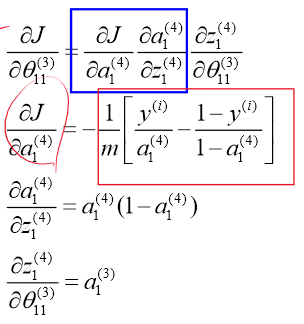
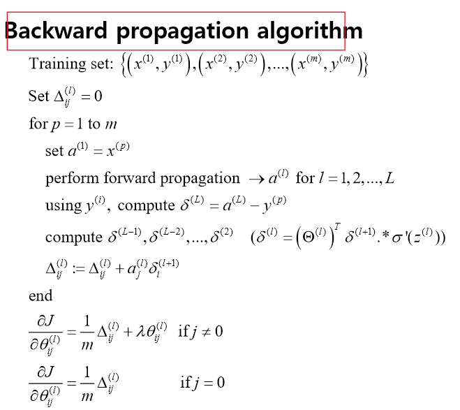
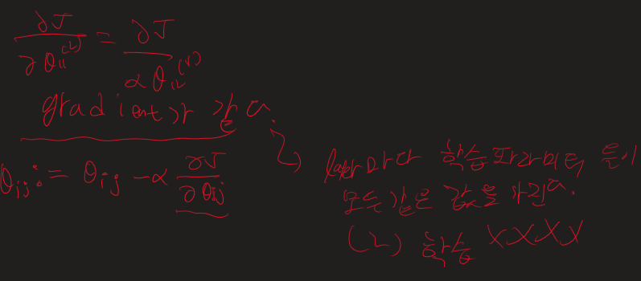
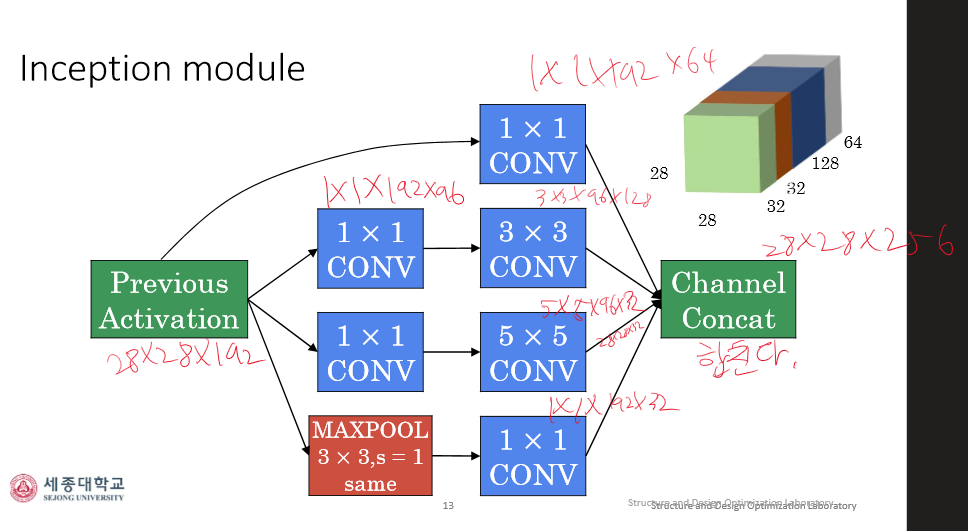
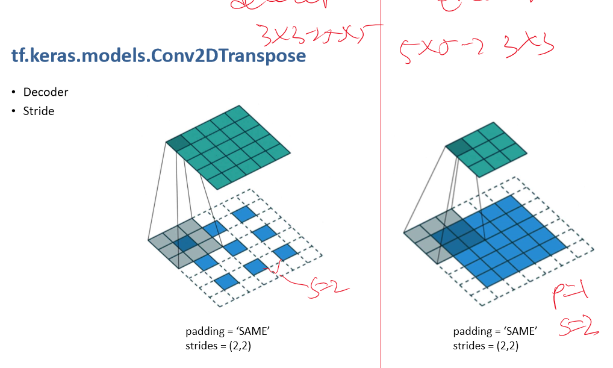
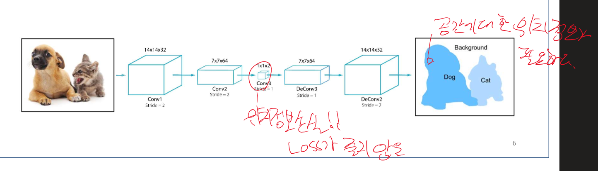

# Linear regression
지도학습(supervised learning)으로 정답을 학습하여 입력에 대한 예측을 보여주며 집값 예측, 키에 따른 몸무게 예측에 사용 가능하다.
## Cost function
예측값에 대한 오차를 Loss function으로 보여주며 값을 감소하는 방향으로 나아간다.

## Epoch, Iteration, SGD, Batch GD, Nimi-Batch-GD

## Gradient descent 

- 앞에서 구한 Cost function를 미분하여 기울기를 구하고 세타(learnable parameters)를 오차가 감소하는 방향으로 업데이트한다.
- 
-  
- 깔끔한 글씨를 쓴 원본이 없어서 다른 자료에서 가져오다 보니 여기선 w(weight, varience)와 b(bias)를 사용한다. w = 세타1, b= 세타0 
## Learning rate

learning rate가 너무 크면 발산하고, 너무 작으면 시간이 오래 걸린다. 그래서 적절한 크기를 골라서 잘 사용해야 하고, dynamic하게 초반엔 크게, 후반엔 작게 하는 방식도 있다.
#   Logistic regression
분류의 문제로, 지도학습이며, 스팸문자 고르기, 종양의 양성 혹은 음성 고르기 에서 사용된다.
## Sigmoid function

## Decision boundary
Logistic regression은 Decision boundary를 그리는 것으로 이해해도 된다. 이 boundary를 그리는 것은 Linear regression과 똑같다.

## predict

## Cost function

## Forward propagation

# Neural network

계산하는 방식은 Logistic regression과 비슷하다. 그러나 Cost function은 마지막에서 구한다는 것, Decision boundary가 비선형적이라는 차이 정도가 있다.

### Forward propagation

### Backward propagation

### over fitting

### Zero initialization (theta= 0)

# Improve a learning algorithm
ex) data 더 모으기, features 줄이거나 늘리기, 차수의 변화, 정규화 시 람다의 증감
### Diagnostic
test set만 테스트 하기엔 우연의 일치를 확인할 수 없다. 즉 교차 검증(cross validation set)를 만든다.
### Cross validation

### Recap

# Activation function and Hyperparameter

### Softmax
Softmax는 Multiclass classfication문제에서 사용한다.

### Hyperparameters
num of(iteraters, layer, node, learning rate), type of (activation function, optimizer)
### Learnable parameters
theta

# CNN

# CAM
판단내리는 데 중요한 곳을 강조 = 설명 가능한 DNN

# Autoencoder

# segmentation, object detection

