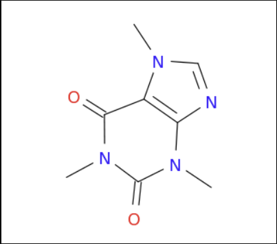

# 1장
#### 관찰 -> 가설 -> 실험 -> 이론 -> 관찰 ......
실험 실패시 관찰로 다시 돌아간다.
### 실험
실험은 재현성이 중요하다.
#### 양, 부피, 온도 등 일관성을 가지고 명확해야 한다.
밀도는 온도에 따라 바뀌기 때문에 온도를 함께 표시한다.

### 온도
$C= \frac{5C}{9K}(aF - 32F)$  
$K = C + 273.15$  
$F = \frac{9F}{5C}*C + 32F$

### 에너지
에너지 $(kg*\frac{m^2}{s^2}= J)$ = 운동E $(\frac{1}{2}mv^2)$ + 위치E 
- 에너지는 열과 일: 1cal = 4.184J : 1g의 물 1도를 올리는데 필요한 J
### 정확도
측정에서 참 값에 얼마나 가까운지
### 정밀도 재현성
여러 독립적인 측정이 서로 얼마나 잘 일치 하는지 
## 유효 숫자
- 0.06 (1개)
- 6.30 (3개)  != 6.3 (2개)
- 34200 (3~5개) 애매해서 다르게 표현한다.
- 3.42*10^4 (3개)
- 3.4200*10^4 (5개)
### 완전수 유효숫자 무한대
- 일주일=7
- 1km = 1000m
### 연산에서 유효숫자 
#### 곱하기와 나누기 (적은 것을 따라간다.)
- 278/ 11.70 = 23.760684 = 23.8 (3개)
#### 더하기와 빼기 (소숫점 작은 것으로)
- 437.1 + 0.2346 = 437.3 (3개)
### 단위 환산 (여러번 바뀔 때는 마지막에)
- 69.5in = 69.5 * 1m/39.37in = 1.77
- 267mi/h = 627mi/h * 1.609km/mi = 429.603km/h = 430.km/h (이렇게 해야 3개)
### 최종
- 5.556 * 2.3 /(4.223 - 0.008) = 5.556*2.3/4.143(4.14) = 3.08 = 3.1
# 2장 원자 분자 및 이온
## 원소
### 멘델레예프의 원자 상대 질량을 통한 주기율표
- 왼쪽: 금속
- 중앙: 전이금속
- 우측: 비금속 (공유결합)
- 금속 + 비금속 = 금속결합
#### 성질
- 물리적 성질: 화학적 구조 변화 X ex) 상변화(물 -> 얼음)
- 화학적 성질: 화학적 구조 변화 O ex) 산화(철 -> 녹)
#### 1족 (수소 제외)
알칼리 금속: 반응성 많이 크다. 다른 원소와 결합하여 존재
#### 2족
알칼리 토 금속: 반응성 크다. 다른 원소와 결합하여 존재
#### 17족
할로젠: 반응성 많이 크다. 다른 원소와 결합하여 존재
- 보통 기체지만 브로민은 액체이다.
#### 18족
비활성 기체: 반응성 거의 없다.
### 금속
수은을 제외하면 상온에서 고체이다.
### 비금속
11개 기체, 5개 고체, 1개 액체(브로민)
### 준금속
반도체 성질로 금속과 비금속 사이이다.
#### 물질은 원자로 이루어져 있다.
보일: 원소는 분해할 수 없다. 원소끼리 화합물을 이룬다.
##### 화학식, 화학 반응식 왼쪽: 반응물질 -> 오른쪽: 생성물질

### 질량보존 법칙
### 배수 비례 법칙
서로 다른 화합물
### 일정 성분비 법칙
물은 수소:산소 질량비는 항상 1:8이다.
### 원자의 구분
양성자의 개수 -> 질량 차이
## 톰슨
### 음극선 실험
전자의 발견 -> 양전하도 있다.
## 러더퍼드
### a입자 산란 실험
푸딩모형(톰슨)으론 산란이 설명되지 않는다.
- 원자핵이 존재하고 반지름이 매우 작다.

## 채드윅
### 중성자
원자 : 전자 + 양성자 + 중성자
### 원자번호
양성자수
### 질량 수 u
양성자 수 + 중성자 수 = 정수, 자연수
### 원자 질량
특정 원자의 원자 질량 단위
- H = 1.007
### 원자량
동위 원소들의 존재비를 고려한 동위 원소 질량의 가중 평균 값
### 동위원소
같은 원자번호지만 다른 질량 수 (불안전)
### 원자 질량 단위
u = C원자 1개의 질량 / 12 = 1.660539 * 10^-24
## 아보가드로 수 NA
6.022*10^23 mol <-> g
### 몰 질량
어떤 물질 1 mol의 질량
### 순 물질
#### 원소 
화학적 방법으로 더 이상 순물질로 분리 ex) H2
#### 화합물
두 가지 이상의 원소가 결합하여 생긴 순 물질 ex) H20
### 혼합물
화학적 반응, 변화 없이 임의로 섞여있는 물질 ex) 설탕물
### 화학 결합
#### 공유
전기 음성도가 낮다: 두개 이상의 원자들이 공유결합으로 분자 생성
#### 이온
전기 음성도가 높다: 이온성 결정이 생기고 독립된 분자가 아니며 이온 결홥 화합물이다.
### 다 원자 이온

## 명명법
### 영어 명명법
처음 양이온, 다음 음이온 + ide 
### 한국 명명법
처음 음이온 + 화 + 양이온
### 이온 결합
갯수 상관 X, 전이 금속에선 갯수 말해주기(FeCl2, FeCl3)
- CuCO3
### 공유 결합
갯수 상관 O
- 하이포 ~ 산
- NO2 아질산
- NO3 질산
- 과산

- N2O4 사산화 질소
#### 이성분 분자성 화합물 명명법 - 접두어 주의!
# 3장 화학반응에서 질량 관계
### 화학 반응 식 
질량 보존 법칙 준수
#### 균형 반응식
가장 간단한 정수 비
### 분자량
분자 내 모든 원자의 원자량 합
### 화학식량
분자식 또는 이온식 화합물의 화학식 단위에 있는 모든 원자의 원자량 합
### 화학양론
반응물과 생성물의 질량을 계산하기 위해 몰 질량을 환산인자로 사용
### 이론적 수득량 / 실제 수득량
역반응 때문에 이론적 양이 안나온다.
### 한계 반응 물
한계량으로 존재하는 반응물
### 초과 반응물
반응 후에도 남아있는 반응물
- A + B = C에서 A2개 B1개 라면 B가 한계 반응물 A가 초과 반응물
#### 조성 백분율 = 질량 백분율
### 실험식
가장 간단한 정수비 C2H5
### 분자식
실제  C4H10
### 연소 분석
탄소와 수소를 포함하는 유기 화합물은 산소와 함께 연소하여 발생되는 CO2와 H2O의 양을 분석하여 실험식을 결정하는 방법
### 잘령 분석기
원자량, 분자량 구하는 가장 일반적인 방법

# 4장 수용액에서의 반응
### 몰 농도 
용질의 몰수 / 용액의 부피
- 1M = 1mol /1L
- 용질을 충분한 양의 용매에 녹여 1리터 용액(최종이 1L)을 만들 때 용질 몰 수
- 용질의 몰수 = 몰농도 * 용액의 부피
- 용액의 부피 = 용질의 몰수/ 몰농도
#### 희석
mol은 그대로, M감소 M0V0 = M1V1
### 전해질
NaCl, HBr과 같이 물에 용해되어 이온 전도성 용액을 만드는 물질
### 비전해질
이온X ex) 설탕, 에틸 알코올
### 해리
물에 녹아 양이온과 음이온이 말들어지는 과정
### 강전해질
물에 녹을 때 해리가 잘 되는것
### 약 전해질
해리가 잘 되지 않는 것    비전해질
### 침전반응
가용성 반응물이 용액 중에 가라앉아 불용성 고체 생성물을 만드는 과정
## 산 염기 중화 반응
산과 염기가 반응하여 물과 염이라고 하는 이온 결합 화합물을 생성하는 과정
### 산
- 용액에 녹을 때 H+이온 생성
### 염기
- 물에 녹을 때 OH- 이온 생성
## 산화 환원 반응
반응 상대들(분자, 원자, 이온)간에 하나 이상의 전자가 이동하는 과정

### 분자 반응식
반응에 관여한 모든 물질은 그들이 마치 분자로 있는 것 처럼 완결 화학식으로 사용한 반응식. 이온은 표현하지 않는다.
- aq 수용액
- g 기체
- l 액체
- s 고체
2HCl(aq) + Zn(s) -> H2(g) + ZnCl2(aq)

### 이온 반응식
이온 형태로 쓴 반응식 (모든 이온이 명확하게 보인다.)
2H+(aq) + 2Cl- + Zn(s) -> H2(g) + Zn2+(aq) + 2Cl-(aq)
#### 알짜이온 반응식
구경꾼들은 제외, 반응에 참여하는 화학종만을 이용
2H+(aq) + Zn(s) -> H2(g) + Zn2+(aq)
### 용해도
각 화합물이 주어진 온도에서 주어지 양의 용매에 얼마나 많이 녹는가
- +1,-1은 해리가 잘 일어난다. 가용성 화합물 -> 녹는다
- +2, -2는 잘 안녹는다. 불용성 화합물 -> 안녹는다 -> 침전
## 중화 반응
### 산
물에서 해리하여 수소이온(H+)를 생성하는 물질
### 염기
물에서 해리하여 수산화이온(OH-)를 생성하는 물질
#### 강산
H+를 많이낸다 = 강전해질
#### 약산
H+를 적게 내는 산 = 약전해질
#### 일양성자산
H+가 1개
#### 다 양성자 산
H+가 2개이상
#### 강염기
OH-를 많이낸다 
#### 약염기
OH-를 적게 내는 염기
#### 산소산
H - O - X   ->  H    O-X
#### 비산소산
산소 X
### 염
산과 염기가 정확한 화학 정적비로 혼합되어 물과 이온성 염이 생성

- 일반적으로 염은 수용액에서 강전해질 => 강산과 강 염기의 중화반응은 이온반응식으로 쓸 수 있음
#### 반응식
HF(aq) + OH- -> H2O(l) + F-(aq)
 - HF는 약한이라 H+ F-로 표기 X
##### 2H+(aq) + 2Br-(aq) + Ba2+(aq) + 2OH-(aq)
- 2BR- + Ba2+ -> BaBr2 염
- 2H+(aq)+ 2OH-(aq) -> 2H2O

### 당량점
종말점

## 산화 환원
### 산화
전자를 잃는 것
### 환원
전자를 얻는 것
### 산화수
전기 음성도가 조금이라도 쌔서 한쪽으로 치우치면 완전히 소유한 것으로 가정
- H - O - H   => +1 - -2 - +1
1. 원소상태에서 원자의 산화수는 0이다
2. 단원자 상태에선 산화수는 0이다
3. 다원자 이온이나 분자 화합물에 있는 원자의 산화수는 일방적으로 그 것이 단원자 이온일 때의 산화수와 같다.
4. 중성 분자에서 산화수의 합은 0이다. 다원자 이온에서 산화수의 합은 알짜 전하와 같다.
- 2Fe2O3 + 3C -> 4Fe + 3Co2
- Fe 환원(+3 -> 0) 산화제
- C 산화(0 -> +4) 환원제
### 활동도 서열
= 이온화 경향 (산화가 잘 되는 순서)
- 강한 환원제 => 산화가 잘 된다 => 전자를 잘 잃는다.
#### 예시
- Cu + 2Ag + -> Cu2+ + 2Ag
- 구리가 순위가 더 높아서 산화되어 전자를 잃었다.
> Au + 3Ag+ -> Au3+ + Ag
- 이 반응은 일어나지 않는다. Au보다 Ag의 순위가 높기 때문이다. 역방향으로 일어난다.

### 산화 환원 적정
환원제 농도 측정 가능
- 5H2C2O4 + 2Mn2O4- + 6H+ -> 10CO2 + 2Mn2+ + 8H2O
- 5:2

$$
    5H_2C_2 O^{-}_4
$$

### 연소
공기 중에서 연료를 산소와 함께 태우는 반응
- CH4 + 2O2 -> CO2 + 2H2O

### 호흡
숨쉬는 과정 + 생물이 필요한 에너지를 공급하는 생물학적 산와
$$
 C_6H_{12}O_6 + 6O_2 => CO_3 + H_2O + E
$$

### 표백
탈색 or 염색을 위한 산화 환원 반응
- $$ H_2O_2, NaOCl$$
### 야금
고아석에서 금속을 추출, 정제하는 과정
$$ZnO + C => Zn + CO$$
### 부식
$$ 4Fe + 3O_2 + H_2O => 2F_2O_3 + H_2O$$

# 5장 주기성과 원자의 전자 구조
## 빛
전자기 복사의 종류
### 전자기 복사
- E 에너지 - 파동
- 물체 - 입자
### 전자
전자(입자)는 파동을 가지지 않을까?
- 위치를 특정할 수 없는 확률
### 복사에너지의 파동성
### 전자기 스펙트럼
복사E의 일종
- X선, 라디오파
### 전자기파 특징
1. 진폭
2. 속도
- 파장 * 진동수 = 속도(m/s) 
3. 파장 (λ)
- m/횟수(c)
4. 진동수 (ν)
- 파장과 반비례(Hz = 1S^-1) 1초간 진동한 횟수
5. 회절
- 물체 주변에서 굽어지는 현상. (이중 슬릿 실험)
6. 간섭
- 강 간섭
- 상쇄 간섭
### 빛의 입자성 (광전효과)
- 빛의 진동수 증가 -> 전자 충돌, 튕겨나감 발생
- 빛의 세기 증가 -> 튕겨나감 X

빛은 입자(광자)와 파동(전자기파)모두를 가진다.
### 일함수
한개의 전자를 빼는데 필요한 에너지
$$E = hν$$
진동수가 증가하면 E도 증가하고, h는 플랑크 상수로 $6.626 * 10^-34J*S$ 이다.
- 각 광자의 E는 그 진동수와 비례하고, 그 빛의 세기와는 상관 없다.
- 빛의 세기는 그 빛에 포함된 광자의 수의 측정, 진동수는 그 광자의 E 측정

### 원자 선 스팩트럼과 양자와된 E
태양 or 전구의 빛 => 백색광(모든 빛이 다 섞여있음)
### 선 스팩트럼
원자 E는 불연속적임을 보여줌
- n=2 => n=1에 떨어질 때 정해져 있다.
- E 흡수 =>(전자 낮은궤도 => 높은 궤도)

$$ \frac{1}\lambda = R[\frac{1}{M^2}-\frac{1}{N^2}]$$
- R: 상수
- M: 낮은 E 궤도
- N: 높은 E 궤도
> 예시 문제  
수소 원자 이온화 E  
$n=\infty => n=1 $  
$ \frac{1}\lambda = R[\frac{1}{1}-\frac{1}{\infty^2}] = R = 1.097*10^3m^{-1}$  
$E =\frac{hc}{y}=2.18*10^{-18}J$  
$E =1312kJ/mol $ 이온화 에너지

### 보어모형
H는 되지만 복잡해지면 안된다.
#### why?
전자는 고정된 궤도X, 정확한 위치를 알 수 없음
$$E = \frac{hc}{\lambda} \rightarrow \lambda = \frac{hc}{E} = \frac{hc}{mc^2}=\frac{h}{mc}= \frac{h}{m\nu}$$
=> 전자의 이중성(입자성과 파동성)
### 슈뢰딩거 - 양자역학적 원자 모형
전자의 파동성
### 하이젠베르크 - 불확정성의 원리
전자가 어디에, 어디로 가는지 모른다 $\rightarrow$ 위치와 속도를 동시에 정확히 알 수 없다.
$$\delta x \delta m \nu \geq \frac{h}{4\pi}$$
### 파동함수 = 오비탈
$\psi^2$ = 전자발견확률

### 주 양자수 = 주 껍질 n
오비탈의 크기와 에너지 준위 결정

### 양자수 l= 0 ~ n-1
오비탈의 3차원 모양을 결정한다, (s, p, d, f)

### 자기 양자수 
방 개수 m = -l ~ +l

#### 간단한 규칙
- s 오비탈은 구형이다.
- n이 클수록 크기도 커진다.
- p 오비탈은 $2p_x,2p_y,2p_z$로 표기한다.
### 스핀 양자수
$\uparrow + \frac{1}{2}, \downarrow - \frac{1}{2}$
### 파울리 배타 원리
한 원재 내의 두 전자는 4개의 양자수를 동일하게 가질 수 없다.
>여기서 양자 상태란 전자의 상태를 결정하는 4개의 양자수 (n, l, m_l, m_s)로 정의됩니다.   
이 4개의 양자수는 각각 주양자수, 방점양자수, 자기양자수, 스핀양자수를 나타냅니다.  
주양자수 (n)은 전자가 속한 에너지 준위를 나타냅니다.  
방점양자수 (l)은 전자의 각운동량을 나타냅니다.  
자기양자수 (m_l)은 방점양자수에 따른 각운동량의 방향을 나타냅니다.  
스핀양자수 (m_s)은 전자의 스핀 상태를 나타냅니다.

### 유효 핵전하
전자 가림으로 인해 떨어진다
### 전자 배치
상대적 에너지 차이로 인한 여러가지 오비탈 중 어디에 채워져 있나
### 쌓음 원리
낮은 에너지 준위의 오비탈 먼저 채운다
#### 에외
- $1s \rightarrow 2s \rightarrow 2p \rightarrow 3s \rightarrow 3p\rightarrow 4s\rightarrow 3d$
> $Na : [Ne]3s^1$  
$Mg:[Ne]3s^2$
- $Cr = [Ar]4s^23d^4 \rightarrow 4s^13d^5$
- $Cu = [Ar]4s^23d^9 \rightarrow 4s^13d^{10}$
#### 전자- 전자 반발력 감소를 통해 총E $\downarrow$
### 원자 반지름
$Cl_2$의 거리 /2 $\rightarrow$ Cl의 반지름

# 화학 실험

1. 아보가드로 수 계산 과정
- 탄소원자 1몰이 차지하는 부피 / 탄소원자 하나가 차지하는 부피 = 아보가드로 수
- 헥세인 1mL 방울 수 구하여 한 방울의 부피 구하기
- 헥산 100ml에 0.01스테아르산이 들어있으므로 앞서 구한 한방울의 부피로 스테아르산 한 방울의 질량 구하기
- 구한 질량으로 밀도를 통해 부피 구하기
- 스테아르산 용액이 덮은 표면적(원의 넓이) 계산하기
- 단층막의 두께 = 스테아르산 한 방울의 부피 / 스테아르산 단층막의 넓이 = 소수성기의 길이 
- 탄소 원자 하나의 직경 = 단층막의 두꼐 / 18(탄소가 1열로 18개가 있다.)
- 정육면체일 경우 부피 = 하나의 직경^3
- 탄소원자 1몰의 부피(다이아의 밀도 이용) = 12 / 다이아의 밀도
- 아보가드로 수 계산 = 탄소원자 1몰의 부피 / 정육먼제 원자 1개의 부피

2. 스테아르산의 특징 특성 물성 소수성 친수성
- $C_{18}H_{36}O_2$ 284.484g/mol 
- 비극성 탄화수소사슬(소수) + 극성 카복실기(친수) 
- 탄소원자 18개가 연결된 곧은 사슬

3. 몰질량 측정 실험 실험에서 몰 질량 측정 어떻게 했는지, 특정 상황을 주고 이 물체의 몰질량을 측정해라
- 미지의 시료 증발시켜 무게 측정, 부피 측정
- 증발시킨 플라스크 - 초기 플라스크 = 응축된 시료 무게(w)
- 플라스크 부피 측정 (V)
- PV= nRT -> M = wRT/PV 몰질량 구하기 완료

4.  보일 샤를의 법칙 암기 O,X문제
- 보일 : PV = 일정 (n,t가 일정할 경우)
- 샤를 : V = T (n,p일정할 경우)
- 아보가드로 : v = n (t,p일정할 경우)

6. 카페인 분리와 추출 -> 카페인 구조 그리기, 시약들의 특징 역할

- 추출: 용매에 따른 용해도 차이가 큰 경우에 사용하는 분리방법, 고체에 포함된 물질의 분리에 주로 사용
- 에멀션: 액체가 다른 액체에 콜로이드 상태로 퍼져있는 상태
- 염석효과 : 친수성 콜로이드 상태의 용액에 전해질을 가하여 엉기게 한 후 추출하는 방법
- 분배계수 : 섞이지 않는 두 액체 A,B가 분리되어 섭해있는 경우, 두 용매에 모두 녹는 용질을 넣고, 용질이 두 용매 사이에서 평형을 이룰 때의 농도비
- CaCO3 탄닌 제거
- MC
- NaCl 뭉치게 해준다.
- NaSO4 MC와 뭉쳐진다.

7. 크로마토 그래피 이게 뭔지, 저기상 이동산? 특징, RF 구하는 법
- 크래마토그래피 : 정지상과 이동상을 이용하여 여러가지 물질들이 섞여있는 혼합물을 이동속도의 차이에 따라 분리하는 방법
- 정상인 경우 : 정지상 - 극성, 이동상 - 비극성. 비정상인 경우 역
- 이동상: 분석물을 이끌고 가는 매게체, 이동상 종류에 따라 기체 액체 크로마토그래피로 나눔
- 정지상: 분석물을 분리하기 위한 메개체, 보통 컬럼의 충전물을 의의. TLC에서는 실리카겔의(극성)을 포함
- TLC : 실리카겔 막을 알루미늄이나 플라스틱 혹은 유리판에 입힌 정지상을 사용하는 방법 
- Rf = 시료 이동거리 / 용매(전개제)의 이동거리

8. 탱탱볼 PDMS 약자 풀네임 암기 
- PDMS : Polydimethylsiloxane 폴리디메틸실록산

9. 실록세인 폴리다인, 어떤 결합을 통해 고분자가 생기는지, 고분자의 특성
- 가교반응 : 사슬 모양 구조의 고분자에 새롭게 화학 결합을 만들어 3차원 그물 구조를 갖게 하는 반응
- 고분자 Polymer : 특정 분자의 결합으로 연결된 분자 Mw >= 10,000g/mol 분자량이 1만 이상

10. 미세접촉 인쇄에선 알케인 싸이올이 어떻게 결합되었는지
- 자기 조립 : 조직되지 않은 기존의 구성요소 체계가 외부로부터의 지시 없이 스스로 특정하고 지역적인 상호작용의 결과로 조직화된 구조나 패턴을 형성하는 과정
- self-assembly-monopolayer : 금속, 금속 산화물, 반도체의 계면활성을 조립할 수 있는 한편, 유동적, 간편한 시스템

11.  시약들의 특성 사용 이유, 작용기
- AgNO3 - 은 이온은 글루코스와 반응하여 환원 작용, 은이 금속 형태로 침전
- Glucose - $C_6H_{12}O_6$ 은을 환원 시키는데 사용
- KOH - 은의 환원을 돕는데 사용, 강염기

12. 액체자성 갈색물질, 검정색 물질 분자식, 검은색 액체의 분자구조 암기해서 그리기, 산화수소 적기
- 갈색물질 분자식

- 검정색 물질 분자식

13. 약물문제 수용액 문제 물붇기 등

15. 답: 임계마이셀의 농도?

16. 액체자성 물질 시약 특성
- FeCl2 - 산화되어 산화철로 변화 가능
- FeCl3 - 화학반응에서 환원 될 수 있다.
- 암모니아수 - 약한 염기성 철 이온과 반응하여 복합체
- 수산화 테트라메틸 암모늄 $C_4H_{13}NO$ - 수산화 이온 제공 철이온과 반응하여 수산화철($Fe(OH)_2$ or $Fe(OH)_3$) 형성

17. 생활속 산 염기 분석 85쪽 지시약 관련 암기 배점 낮다

18. 비누화 반응 중성지방 + NH 넣었을 때 어떤 반응 작용기 어떤게 끊어지는지 마이스배스 왜 쓰는지 칠판에 적었떤 것 암기 핸더슨 마일 암기
- 중성지방이 알칼리와 반응하여 글리세롤 + 지방산염으로 분해
- 에스테르 결합이 끊어진다.

21문제
